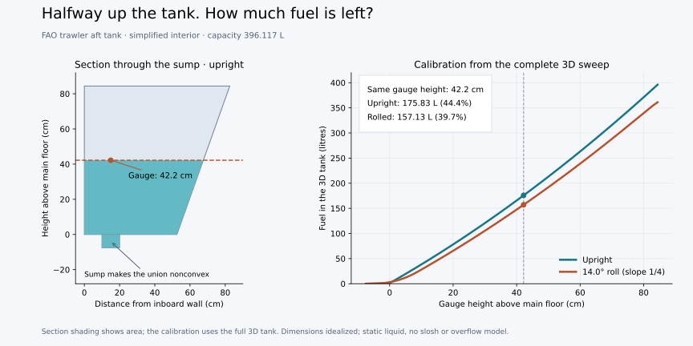

# nefvol — exact sweep-plane volume of a union of polytopes

`nefvol` computes, for a union `U = P_1 ∪ … ∪ P_k` of rational polytopes
given by inequalities and a sweep direction `a`,

    s(a, λ) = vol( U ∩ { x : ⟨a, x⟩ ≤ λ } )

as an **exact** piecewise polynomial in `λ`, plus point evaluations and the
total volume `s(a, +∞)`.  Polytopes may overlap, nest, touch or be disjoint.

It is one algorithm made of two halves that share a single per-vertex object:

* **Reverse search** (Avis–Fukuda) walks the vertices of the hyperplane
  arrangement on `∂U`, one facet at a time, each vertex exactly once, with no
  visited set — memory is the current root path only.
* **Sweep plane** (Bieri–Nef) turns the tangent cone at each such vertex into
  signed simplicial terms `α (λ − ⟨a,v⟩)_+^d` that accumulate into a knot map.

Both are driven by the central arrangement of the hyperplanes through the
vertex: its lines are the search's edges, its bases are the sweep's cones.
See [References and acknowledgments](#references-and-acknowledgments) for the
mathematical sources and validation tools, and [`docs/DESIGN.md`](docs/DESIGN.md)
for the mathematics (in particular the
symbolic-perturbation form of the tangent-cone decomposition that makes the
kernel a single factorisation per basis) and
[`docs/REPORT.md`](docs/REPORT.md) for measurements.  The original brief is
[`SPEC.md`](SPEC.md).

## Build

Rust 1.75+ (stable).  No GMP: arithmetic is `i128` with automatic promotion
to `num-bigint`.

    cargo build --release
    cargo test --release          # unit, golden, differential, Monte Carlo, recorded lrs values

## Usage

    nefvol volume --input <file> [--input <file>…] [--direction a1,a2,…]
    nefvol sweep  --input <file> --direction a1,a2,… [--at λ]… [--json]
    nefvol plot   --input <file> --direction a1,a2,… --samples N

Common options: `--threads N`, `--budget N` (nodes per subtree task, 0 = no
splitting), `--assume-generic` (fail instead of perturbing when `a` is
orthogonal to an edge), `--oracle` (brute-force enumerator, for checking),
`--seed S`, `-v`, `--stats-json` (run statistics on stderr).

Example:

    $ nefvol sweep --input inputs/square.ine --direction 1,2 --at 1
    direction a = (1, 2)
    breakpoints (4):
      0
      1
      2
      3
    pieces (coefficients of λ^0..λ^2):
      [-inf, 0): 0
      [0, 1): 1/4·λ^2
      [1, 2): -1/4 + 1/2·λ
      [2, 3): -5/4 + 3/2·λ + -1/4·λ^2
      [3, +inf): 1
    total volume: 1
    s(1) = 1/4

### Input formats

* **lrs/cdd `.ine`** H-representation.  Each row `b a_1 … a_d` means
  `b + Σ a_i x_i ≥ 0`.  Several `begin … end` blocks in one file, or several
  `--input` files, form a union.  `linearity` rows are rejected (polytopes
  must be full-dimensional).
* **JSON**: `{"polytopes": [{"A": [[…]], "b": […]}, …]}` meaning `A x ≤ b`;
  entries may be numbers or strings such as `"7/2"`.

Each polytope must be bounded and full-dimensional; the preprocessing checks
this with exact LPs and exits with a message otherwise.  Redundant
constraints are removed automatically.

## Layout

| file | role |
|---|---|
| `src/num.rs` | hybrid integer `Z` (i128 → BigInt), rationals `Q`, points |
| `src/linalg.rs` | fraction-free `(det, adj)`, incremental echelon form |
| `src/geom.rs` | canonical hyperplanes, polytopes, shared arrangement, fast `i64` mirror |
| `src/local.rs` | **the fused kernel**: lines and signed cones at a vertex, Laurent terms |
| `src/walk.rs` | tangent-cone filter, parent rule, ratio test, exact simplex walk |
| `src/reverse.rs` | per-facet reverse search with budgeted subtree tasks |
| `src/vertex.rs` | `∂U` test, ownership, per-vertex accumulation |
| `src/sweep.rs` | knot map, pieces, evaluation, pole-cancellation check |
| `src/preprocess.rs` | vertex finding, boundedness, dimension, redundancy |
| `src/oracle.rs` | brute-force `d`-subset enumerator (test oracle) |
| `src/driver.rs` | pipeline and parallel execution |
| `src/io.rs`, `src/main.rs` | formats and CLI |
| `scripts/gen.py` | benchmark instance generator |
| `scripts/lrs_check.py` | optional: regenerates `tests/lrs_golden.txt` from an `lrs` binary |
| `scripts/bench.sh` | reproduces the report tables |

## Non-goals

Full Nef generality (complements, open faces), unbounded polyhedra,
floating-point fast paths.  The tangent-cone representation (signed cells per
basis) is local to `local.rs`, so Nef generality can be added there without
touching the accumulator.

## Interactive browser viewer (2D)

    cargo build --release
    python3 scripts/viewer.py

Open **http://127.0.0.1:8765**, choose one or more `.ine` or JSON files, enter
an unnormalized sweep direction (for example `1,2`) and optionally an initial
λ, then click **Compute**. The union and swept portion appear beside the
cumulative area graph. Drag the slider or enter a number/fraction in the λ
field to move both markers. λ is clamped to the minimum and maximum vertex
projections. Hover over the area readout for its exact rational value.

Each Compute invokes the existing algorithm once and caches the complete
piecewise polynomial in the browser. Slider movement makes no server requests;
polynomial evaluation uses exact rational arithmetic, with floating-point
conversion only for display. Changing files or direction requires Compute
again. Invalid, unbounded, lower-dimensional, and non-2D inputs show errors.

For a more complex example, load [`inputs/overlap2d_50.ine`](inputs/overlap2d_50.ine):
50 overlapping convex polygons formed by clipping random boxes with four
additional halfspaces. They form one connected union, with 289 pairs sharing
positive area. Try direction `1,2` and move λ through the full range.
Regenerate the same input with:

    python3 scripts/gen.py rand 2 4 50 42 > inputs/overlap2d_50.ine

Python 3 and a modern browser are required; no npm install or external web
assets are needed. The server binds only to localhost. Use `--port` to select
another port or `--binary` to select a nefvol executable. Stop with Ctrl+C.
Requests are limited to 8 MiB and computations to 120 seconds.

### Application example: fuel-gauge calibration

The [FAO trawler tank example](docs/TANK.md) asks how many litres remain at a
given liquid level and boat tilt. It includes a [3D tank input](inputs/fao_tank3d.ine)
and a [2D section](inputs/fao_tank2d.ine) for this viewer. The tapered body
and small sump form a nonconvex union. At a gauge height of 42.2 cm, the
simplified model holds 175.83 L upright or 157.13 L at about 14° roll.
The example documents its source dimensions, assumptions and exact checks.

Load the 2D section with direction `0,1` and initial λ `4.22` to explore
the shape. Its area readout is in dm²; use the 3D input with `nefvol sweep`
for fuel quantities in litres. See the example for the tilted gauge-to-λ
conversion and commands to reproduce the figure.

### Viewer presentation interface

The `nefvol view-data --input … --direction 1,2` command returns presentation
JSON: dimension, coordinate-array vertices per polytope, direction, λ range,
exact polynomial pieces, and total volume. Geometry extraction and the
`Renderer2D` interface are separate from solving, graphing, and controls. A 3D
extension needs polyhedron vertices/faces and a renderer (such as Three.js)
implementing `update(lambda)`; this version does not yet render 3D.

Viewer checks: `cargo test --release --test viewer` and
`node viewer/math.test.mjs`.
For the optional browser regression check, start the viewer, make Playwright
available to Node, and run `node viewer/browser.test.cjs`. `VIEWER_URL` overrides
the server URL; `PLAYWRIGHT_MODULE` can point to an external Playwright install.
The check exercises file loading, slider synchronization, cached requests,
fraction input, direction changes, and unsupported dimensions.

## References and acknowledgments

The mathematical methods and related work behind this implementation are:

* **Reverse search:** David Avis and Komei Fukuda,
  [*A pivoting algorithm for convex hulls and vertex enumeration of arrangements and polyhedra*](https://doi.org/10.1007/BF02293050).
  *Discrete & Computational Geometry* **8**, 295–313 (1992).
  This is the reverse-search foundation of the vertex traversal; the per-facet
  traversal and its integration with the sweep kernel are described in
  [the design notes](docs/DESIGN.md#3-the-reverse-search-half).
* **Sweep-plane volume:** H. Bieri and W. Nef,
  [*A sweep-plane algorithm for computing the volume of polyhedra represented in boolean form*](https://doi.org/10.1016/0024-3795(83)80008-1).
  *Linear Algebra and its Applications* **52–53**, 69–97 (1983).
  This supplies the sweep-plane approach of accumulating local vertex
  contributions to compute volume.
* **Earlier work on unions and volume curves:** Lovis Anderson and Benjamin Hiller,
  [*A Sweep-Plane Algorithm for the Computation of the Volume of a Union of Polytopes*](https://doi.org/10.1007/978-3-030-18500-8_12).
  In *Operations Research Proceedings 2018*, pp. 87–93, Springer (2019);
  preprint: ZIB-Report 18-37 (2018).
  This revises the Bieri–Nef approach for unions of polytopes and computes volume
  as a function of sweep-plane offset. It is the prior work cited in the
  [project brief](SPEC.md); the fused reverse-search implementation is documented
  separately in [the design notes](docs/DESIGN.md).
* **Vertex-cone volume formula:** Jim Lawrence,
  [*Polytope volume computation*](https://www.ams.org/mcom/1991-57-195/S0025-5718-1991-1079024-2/S0025-5718-1991-1079024-2.pdf).
  *Mathematics of Computation* **57**(195), 259–271 (1991).
  Background for the local volume terms used in
  [the sweep derivation](docs/DESIGN.md#21-the-lawrence-valuation).
* **Tangent-cone decomposition:** Michel Brion,
  [*Points entiers dans les polyèdres convexes*](https://doi.org/10.24033/asens.1572).
  *Annales scientifiques de l'École Normale Supérieure*, série 4,
  **21**(4), 653–663 (1988).
  Background for the vertex-cone identities invoked in the design notes;
  the extension to unions by inclusion–exclusion is explained there.

### Validation software and example data

[`lrslib`](https://cgm.cs.mcgill.ca/~avis/C/lrs.html), maintained by David Avis
and collaborators, is the external reference implementation used for validation.
The Rust solver implements its traversal in this repository; it does not call
or link `lrslib` during normal computation. The optional
[`scripts/lrs_check.py`](scripts/lrs_check.py) invokes an external `lrs` binary
to enumerate vertices and compute reference volumes. The 276 recorded values
in [`tests/lrs_golden.txt`](tests/lrs_golden.txt) were generated with `lrslib-073`
and check individual convex pieces' total volumes, rather than complete volume
curves for overlapping unions. See [the report](docs/REPORT.md) for the other
validation methods.

The benchmark shapes are generated by [`scripts/gen.py`](scripts/gen.py).
The tank example is a simplified reconstruction from an **FAO trawler drawing**;
[its documentation](docs/TANK.md) links the original drawing and records the
dimensions and modeling assumptions. The reconstruction and computed curves
are this project's example, not measured FAO calibration data.
